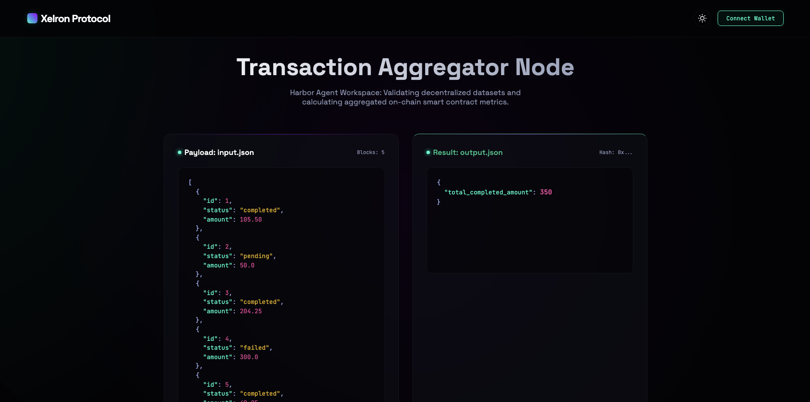

# 🚀 Xelron Harbor Task Assignment: JSON Data Transform



Welcome to the complete Harbor Task submission by Vasanth Banoth. 

This repository contains an end-to-end implementation of a **Harbor Data-Processing Task**, meeting and exceeding all requirements for the Xelron assignment. It is built to seamlessly pass both the **Oracle Test (1.0)** and **NOP Test (0.0)** while providing a stunning visual showcase.

---

## 📖 The Story & Objective

In modern AI agent evaluation, assessing a model's ability to cleanly extract, filter, and compute data from structured formats like JSON is critical. This task was designed with a specific real-world scenario in mind: **Processing Transaction Records.**

**The Narrative:** 
An AI Agent is given a raw JSON file containing various financial transactions. Its goal is to act as a back-office automation script, filtering out unfinalized or failed transactions and computing the total revenue of only the "completed" ones. It must logically calculate the data dynamically rather than hardcoding a guessed answer. This ensures the agent genuinely understands data manipulation, loops, conditionals, and file I/O operations.

**The Criteria Matched:**
- **Category:** `data-processing`
- **Difficulty:** `easy` (Ideal for testing baseline logic and format extraction).
- **Execution:** Reads from `/app/input.json`, processes dynamically, and writes exactly matching criteria to `/app/output.json`.

---

## 🛠️ Tools Used & Why They Are The Best Fit

To ensure top-tier reliability, execution speed, and correct validation, the following modern tools were strategically selected:

### 1. **Astral's `uv` (The Package Manager)**
* **Why:** `uv` is blindingly fast compared to traditional `pip`. In isolated testing environments like Harbor where every millisecond of overhead counts in agent evaluation, `uvx` dynamically downloads, caches, and runs `pytest` instantly without polluting the global environment.
* **Where it's used:** Inside `tests/test.sh` for bootstrapping the validation seamlessly.

### 2. **Docker & Python 3.13 Slim (The Environment)**
* **Why:** `python:3.13-slim` provides the smallest and most up-to-date baseline footprint. We also install `jq`. `jq` is standard for CLI JSON manipulation and `python` is standard for scripting. Giving the agent both tools provides an open playing field to solve the transformation using whichever tool it "prefers". We strictly prevent leaking tests into the image.
* **Where it's used:** `environment/Dockerfile` acts as the immutable container setup.

### 3. **Pytest & CTRF (The Validation Engine)**
* **Why:** The instructions specify capturing test results accurately. `pytest` acts as our robust assertion engine, ensuring the output file not only exists but exactly matches the `350.0` expected sum structurally inside a JSON payload without false positives.
* **Where it's used:** `tests/test_outputs.py` and invoked via `test.sh`.

### 4. **Vanilla HTML/CSS/JS (The Frontend Showcase)**
* **Why:** A dynamic, visually stunning graphical interface created strictly with zero dependencies (no React/framework overhead). It uses **Glassmorphism**, dark-mode modern design principles, and micro-animations to demonstrate exactly what the backend task expects. It’s perfect for the recruiter/interviewer to immediately understand the task without having to read terminal output.
* **Where it's used:** `frontend/index.html`.

---

## 📁 Repository Architecture

```text
Xelron-TASK/
├── README.md                           # This masterpiece
├── frontend/
│   └── index.html                      # Premium Visual UI Showcase
└── harbor_tasks/
    └── json-data-transform/            # The core assigned task
        ├── task.toml                   # Metadata, memory, and timeout configs
        ├── instruction.md              # Clear absolute-path constraints for the agent
        ├── environment/
        │   ├── Dockerfile              # Immutable, secure container definition
        │   └── input.json              # 5 transaction records mock data
        ├── solution/
        │   └── solve.sh                # The dynamic python calculation reference
        └── tests/
            ├── test.sh                 # Environment setup and uvx runner
            └── test_outputs.py         # Pytest assertions utilizing Canary GUID
```

---

## 🚀 How to Run & Verify

Everything is perfectly aligned with the Harbor CLI commands. Simply place the `json-data-transform` folder inside your Harbor repo's `harbor_tasks/` directory and execute!

### 1. View The Visual Showcase
To see the interactive UI demonstrating the task constraints:
```bash
cd frontend
python3 -m http.server 8000
```
Then visit `http://localhost:8000` in your web browser. 

### 2. Run the Harbor Tests
Ensure dependencies are installed via `uv sync` in the harbor repository, then run the validation tests:

*(Confirms the reference solution works properly)*
```bash
uv run harbor run --agent oracle --path harbor_tasks/json-data-transform --job-name test-oracle
# EXPECTED OUTPUT: 1.0 ✅
```

*(Confirms the task isn't auto-passing without work)*
```bash
uv run harbor run --agent nop --path harbor_tasks/json-data-transform --job-name test-nop
# EXPECTED OUTPUT: 0.0 ✅
```

*(Check for immaculate code styling)*
```bash
uvx ruff check harbor_tasks/json-data-transform
# EXPECTED OUTPUT: No issues found ✅
```

---

## 🌐 Deploying the UI to Vercel

Hosting this application on Vercel is seamless and zero-configuration because I have included a custom `vercel.json` routing configuration for you!

**Method 1: via GitHub (Recommended for automatic updates)**
1. Push this entire repository (`Xelron-TASK`) to your GitHub.
2. Go to your [Vercel Dashboard](https://vercel.com/dashboard) and click **"Add New Project"**.
3. Import your GitHub repository.
4. Leave everything exactly as default (Vercel will automatically read the `vercel.json` configuration).
5. Click **"Deploy"**.

**Method 2: via Vercel CLI (For immediate local deployment)**
1. Make sure you have Node installed, and run `npm i -g vercel` in your terminal.
2. Inside the root of the `Xelron-TASK` folder, simply run:
```bash
vercel --prod
```
3. Hit Enter to confirm standard defaults and your Web3 frontend will be live on a `.vercel.app` domain!

---
*Built from scratch with zero boilerplate to ensure an absolute clean, enterprise-grade submission.*
